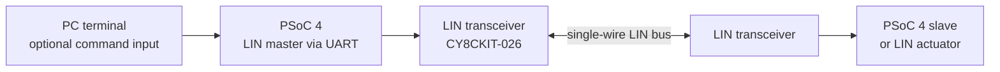

# LIN Automotive

**Practical LIN 2.2 frame utilities and PSoC 4 master/slave projects for automotive electronics.**

[](https://www.lin-cia.org/)
[](https://en.wikipedia.org/wiki/C_(programming_language))
[](https://www.infineon.com/cms/en/product/promopages/psoc4/)
[](LICENSE)
[](https://jagumiel.xyz/blog/2022/03/20/puesta-en-marcha-del-protocolo-para-automocion-lin/)

This repository explores the **Local Interconnect Network (LIN)** through a set of progressively more capable embedded projects. It combines small C utilities for frame calculations with working master/slave examples developed for Cypress/Infineon PSoC 4 boards.

The examples cover raw frame transmission over UART, LIN slave communication, RGB and interior-light control, frames with multiple signals, node feedback, low-power control through `NSLP`, and an experimental interface for a real LIN-controlled stepper actuator.

> **Looking for the theory and hardware setup?** Read the illustrated article [*Puesta en marcha del protocolo para automoción LIN*](https://jagumiel.xyz/blog/2022/03/20/puesta-en-marcha-del-protocolo-para-automocion-lin/) (in Spanish). It explains the LIN frame, PID and enhanced-checksum calculations, the PSoC hardware, and the master/slave wiring used by these projects.

## Why LIN?

LIN is a low-cost, deterministic, single-wire communication bus used in distributed automotive electronics. A master schedules all communication, while slave nodes publish or consume signals in response to the requested frame identifier. It is commonly suited to body and comfort functions that do not require the bandwidth of CAN.

A LIN 2.2 frame is structured as follows:

| Field | Publisher | Purpose |
| --- | --- | --- |
| Break | Master | Marks the beginning of a new frame |
| Sync (`0x55`) | Master | Allows slave nodes to synchronize to the bus rate |
| Protected Identifier (PID) | Master | Six-bit frame ID plus two parity bits |
| Data (1–8 bytes) | Master or slave | Carries the signals associated with the frame |
| Checksum | Data publisher | Detects errors in the transmitted response |

The examples in this repository focus on **LIN 2.2** and use the enhanced checksum where applicable.

## System architecture



The PSoC 4 master creates the LIN header and, when it is the frame publisher, sends the response bytes and checksum. The CY8CKIT-026 shield adapts the microcontroller's UART-level TX/RX signals to the 12 V single-wire LIN bus. The slave project uses the PSoC LIN component and an LDF-defined signal configuration.

## Repository contents

### Training projects

| Project | What it demonstrates |
| --- | --- |
| [1 — LIN Master/Slave Communication](Training/1-LIN-Master-Slave-COM/) | First end-to-end test. A UART-based master transmits a prepared LIN frame to a PSoC LIN slave, which controls an RGB LED and can publish its current state. Includes LDF and Baby-LIN test files. |
| [2 — LIN Master Orders](Training/2-LIN-Master-Orders/) | Calculates the PID and checksum at runtime. Push buttons select RGB commands or request the slave's status. |
| [3 — Internal Light Control](Training/3-LIN-Internal-Light-Control/) | Models an interior-light ECU and slave pair, using LIN commands and PWM transitions to control left and right lighting outputs. |
| [4 — RGB Multiple Data](Training/4-LIN-RGB_Multiple_Data/) | Accepts commands from a PC over UART and sends either a single-channel brightness update or three RGB values in one LIN frame. The master can also request the slave's current RGB state. |
| [5 — Sonceboz Stepper Motor Test](Training/5-LIN-Sonceboz_Stepper_Motor_Test/) | Experimental communication with a real Sonceboz 5877R1007 LIN stepper actuator, including calibration, position commands, response reads, and `NSLP` control. |

The sequence is intended to be followed from project 1 to project 5: it starts with a fixed frame and gradually introduces runtime calculations, bidirectional communication, multiple signals, PWM-controlled loads, and a real automotive LIN device.

### C utilities

| Utility | Purpose |
| --- | --- |
| [`pid_calculator.c`](Utilities/pid_calculator.c) | Generates the two parity bits and protected identifier for a LIN 2.2 frame ID. |
| [`checksum_calculator.c`](Utilities/checksum_calculator.c) | Calculates an enhanced checksum from a PID and an eight-byte data field. |
| [`full_frame_calculator.c`](Utilities/full_frame_calculator.c) | Combines PID and checksum calculations in an interactive frame-building prototype. |

The first two programs contain example values that can be changed directly in the source. They can be compiled with any standard C compiler:

```bash
gcc -std=c11 Utilities/pid_calculator.c -o pid_calculator
gcc -std=c11 Utilities/checksum_calculator.c -o checksum_calculator
```

With the values currently included in the repository, the programs produce:

```text
PID: 50
Checksum: 7C
```

`full_frame_calculator.c` is retained as an interactive prototype. Its input handling requires cleanup before it should be treated as a robust command-line tool; see [Project status and limitations](#project-status-and-limitations).

## Hardware

The master/slave setup documented in the repository uses:

- Two **CY8CKIT-042 PSoC 4 Pioneer Kits**
- One **CY8CKIT-026 CAN and LIN Shield Kit**
- A suitable external supply for the LIN shield
- A shared ground between the participating boards
- Optional LIN analyzer for inspecting or emulating nodes
- **Sonceboz 5877R1007** stepper actuator for project 5

The CY8CKIT-026 provides two LIN interfaces. In the documented setup, one interface is configured as the master transceiver and the other as the slave transceiver. This requires component and jumper configuration; do not power the hardware before checking the schematic and the modification table in the [technical article](https://jagumiel.xyz/blog/2022/03/20/puesta-en-marcha-del-protocolo-para-automocion-lin/).

## Software requirements

- **PSoC Creator 4.2 or later** for the embedded projects
- PSoC 4 toolchain supplied with PSoC Creator
- A compatible programmer/debugger for the CY8CKIT-042
- A C compiler such as GCC for the desktop utilities

Some source files originated from earlier Cypress examples and mention PSoC Creator 3.3 SP1. The repository projects were subsequently used with PSoC Creator 4.2; newer tool versions may request a project migration.

## Getting started

### 1. Clone the repository

```bash
git clone https://github.com/jagumiel/LIN-Automotive.git
cd LIN-Automotive
```

### 2. Choose a training project

Start with [`Training/1-LIN-Master-Slave-COM`](Training/1-LIN-Master-Slave-COM/) to understand the basic exchange before moving to the more advanced examples.

Most exercises contain separate master and slave projects. Program each project into its corresponding CY8CKIT-042 board.

### 3. Open the PSoC project

In PSoC Creator:

1. Open the supplied `.cywrk` workspace when available.
2. Otherwise, create a workspace and add the required `.cyprj` file as an existing project.
3. Review the pin assignments and component configuration for your exact board revision.
4. Build the project and resolve any migration messages from the IDE.
5. Program the appropriate PSoC 4 board.

### 4. Connect the LIN hardware

Verify all of the following before applying power:

- The master and slave transceiver configuration
- RX, TX, `NSLP`, LIN, ground, and supply connections
- The 3.3 V/5 V logic-selection jumpers on the development boards
- The shield's external supply requirements

The complete wiring and hardware changes are shown in the [step-by-step article](https://jagumiel.xyz/blog/2022/03/20/puesta-en-marcha-del-protocolo-para-automocion-lin/).

## Example: RGB multiple-data commands

Project 4 accepts ASCII commands from a PC through the master's debug UART:

```text
W255090030
```

This sets the red, green, and blue channels to `255`, `90`, and `30` in a single multi-signal frame.

An individual channel can be updated with commands such as:

```text
R217
G096
B123
```

Pressing the configured push button makes the master request the slave's current RGB values and reproduce them on its own LED outputs.

## LDF and test assets

The repository includes LIN Description Files (`.ldf`) for the basic RGB slave and the multiple-data example. These describe:

- Master and slave nodes
- Frame identifiers and publishers
- Signals and their bit positions
- Schedule tables
- Logical and physical encodings

Selected projects also include `.sdf` files used during development with Baby-LIN tooling. These assets help relate the embedded implementation to the network-level LIN configuration.

## Project status and limitations

This is an educational and experimental repository that records the progression from basic LIN communication to control of a real actuator. It is useful as a reference and starting point, but it is **not production automotive software**.

Current limitations include:

- No automated build, hardware-in-the-loop test, or continuous integration
- Projects target the legacy PSoC Creator environment
- Generated PSoC files and build artifacts are still present in the repository
- Some examples contain fixed IDs, frame sizes, timing values, or device-specific commands
- The interactive full-frame C utility needs safer input parsing and validation
- The examples have not been assessed for functional safety, cybersecurity, EMC, or production compliance

Review the electrical design, protocol timing, checksums, device datasheets, and error handling before adapting any example to other hardware or a vehicle network.

## Related reading

- [Puesta en marcha del protocolo para automoción LIN](https://jagumiel.xyz/blog/2022/03/20/puesta-en-marcha-del-protocolo-para-automocion-lin/) — theory, PID/checksum examples, hardware modifications, wiring, and PSoC implementation
- [LIN Consortium / LIN standards](https://www.lin-cia.org/standards/)
- [Infineon PSoC 4](https://www.infineon.com/cms/en/product/promopages/psoc4/)

## Contributing

Bug reports, protocol corrections, improved test vectors, documentation updates, and ports to newer hardware are welcome. Please open an issue before proposing a substantial redesign so that the scope can be discussed first.

## License

The repository is distributed under the [MIT License](LICENSE). Files originating from Cypress/Infineon examples or generated by vendor tools may contain additional copyright and licensing notices; those notices remain applicable to the corresponding files.

## Author

Created by [Jose Ángel Gumiel](https://github.com/jagumiel).

More projects and technical articles are available at [jagumiel.xyz](https://jagumiel.xyz/).
